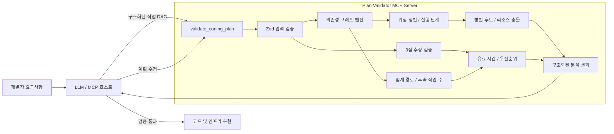
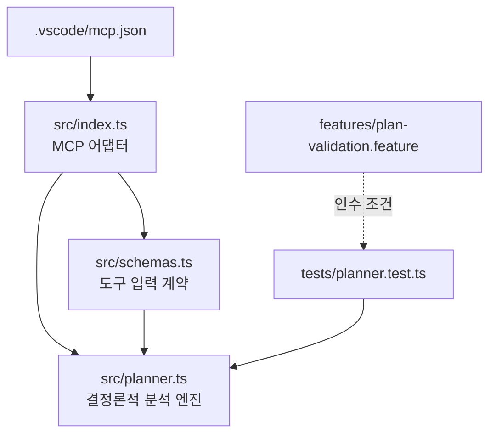

# Agentic Coding Plan Validator

개발자의 요구사항에서 도출된 작업을 실행 가능한 작업 그래프로 검증하고, LLM이 더 현실적인 개발 계획을 세우도록 돕는 MCP 도구입니다.

각 작업의 예상 소요 시간과 선행 조건을 검사하고, 독립 작업을 병렬 처리 후보로 분류합니다. 임계 경로에 있거나 오래 걸리거나 많은 후속 작업의 선행 조건인 작업은 먼저 시작하도록 우선순위를 조정합니다. 실행 불가능한 순서와 과도하게 낙관적인 추정을 줄여 계획 생성부터 구현 완료까지의 시간을 단축하는 것이 목표입니다.

## 구현 방향

**에이전트가 아닌 MCP 도구를 핵심 구현으로 선택했습니다.**

LLM 에이전트는 자연어 요구사항을 작업 목록으로 분해하고 결과를 설명하는 데 적합하지만, 그래프 순환 탐지, 위상 정렬, 임계 경로 계산 같은 규칙을 안정적으로 반복하기에는 적합하지 않습니다. 이 프로젝트는 결정론적 검증 로직을 MCP 도구로 제공하여 VS Code 등 어떤 MCP 호스트의 에이전트에서도 재사용할 수 있게 합니다.

권장 사용 방식은 하이브리드입니다.

1. 호스트 LLM이 자연어 요구사항을 구조화된 작업 그래프로 변환합니다.
2. `validate_coding_plan` 도구가 그래프와 추정치를 검증하고 일정을 계산합니다.
3. 호스트 LLM이 경고와 우선순위를 반영해 계획을 수정한 뒤 구현합니다.

별도 에이전트는 현재 만들지 않습니다. 향후 요구사항 분해 방식이나 조직별 계획 정책을 고정해야 할 때 이 도구를 호출하는 얇은 에이전트를 추가할 수 있습니다.

## GitHub Copilot Orchestrate와의 차이

여기서 **GitHub Copilot Orchestrate**는 Copilot의 여러 에이전트 또는 세션을 독립된 작업 공간에서 병렬 실행하고, 진행 상태와 코드 변경 및 PR 수명주기를 관리하는 오케스트레이션 기능을 의미합니다. 이 프로젝트는 에이전트를 직접 실행하지 않고, 오케스트레이터가 실행할 계획의 타당성을 사전에 계산하는 검증기입니다.

| 구분 | GitHub Copilot Orchestrate | Agentic Coding Plan Validator |
| --- | --- | --- |
| 주 책임 | 에이전트 세션 실행, 격리, 진행 추적, 결과 통합 | 작업 DAG, 추정 시간, 선행 조건, 실행 순서 검증 |
| 입력 | 자연어 작업, 저장소 컨텍스트, 에이전트 설정 | 구조화된 작업과 의존성 및 3점 추정치 |
| 출력 | 코드 변경, 커밋, 브랜치 또는 PR, 세션 상태 | 오류와 경고, 실행 단계, 병렬 후보, 임계 경로, 우선순위 |
| 병렬 처리 | Git worktree 등으로 여러 실행 세션을 서로 격리 | 의존 경로와 배타 리소스를 분석해 병렬 실행 가능 여부 판정 |
| 시간 계획 | 에이전트 실행과 상태 관리가 중심 | PERT 기대 시간, 실측 하한, 최소 경과 시간 계산이 중심 |
| 부작용 | 파일 수정, 명령 실행, PR 생성 가능 | 분석만 수행하며 저장소나 인프라를 변경하지 않음 |
| 적용 범위 | GitHub Copilot의 개발 실행 환경 | MCP를 지원하는 호스트에서 재사용 가능한 정책 엔진 |

두 기능은 경쟁 관계가 아니라 앞뒤 단계의 보완 관계입니다.


따라서 이 프로젝트의 제품 경계는 **오케스트레이션을 대체하는 도구**가 아니라 **오케스트레이션 전에 실행 가능성을 보증하는 계획 품질 게이트**입니다. Copilot에 MCP 서버로 연결하면 Copilot이 작업을 배정하기 전에 `validate_coding_plan`을 호출하고, 반환된 실행 단계와 우선순위를 세션 배정에 반영할 수 있습니다. GitHub의 에이전트 개요와 병렬 세션 동작은 [Copilot agents 문서](https://docs.github.com/en/copilot/concepts/agents)와 [병렬 에이전트 세션 설명](https://github.blog/ai-and-ml/github-copilot/github-copilot-app-for-beginners-run-several-agents-at-once/)을 참고합니다.

## 아키텍처



내부 코드는 전송 계층과 도메인 로직을 분리합니다.



## 검증 가능한 작업

Azure App Service와 Azure SQL 프로비저닝은 하나의 예시일 뿐입니다. 다음을 포함한 모든 개발 작업을 같은 작업 그래프로 검증할 수 있습니다.

- 요구사항 조사, 기술 조사, 설계
- 프런트엔드, 백엔드, API, 자동화 코드 구현
- 단위, 통합, E2E, 성능 테스트
- 클라우드 및 온프레미스 인프라 프로비저닝
- 스키마 변경, 데이터 마이그레이션, 백필
- 보안 검토, 코드 리뷰, 문서화
- 빌드, 패키징, 배포, 운영 검증
- 외부 팀 승인, 수동 작업, 사용자 정의 작업

도구는 작업 내용 자체가 맞는지 판정하는 대신 다음의 **계획 품질**을 검증합니다.

- 중복 작업 ID, 누락된 선행 작업, 순환 의존성
- 낙관/최빈/비관 3점 추정치의 순서와 불확실성
- 실측 또는 SLA 기반 최소 소요 시간보다 짧은 추정
- 위상 실행 단계와 독립 작업의 병렬 실행 가능성
- 동일한 배타 리소스를 사용하는 작업 사이의 충돌
- 임계 경로, 최소 경과 시간, 총 직렬 작업량
- 긴 작업과 다수 후속 작업을 막는 선행 작업의 우선순위

작업 종류별 소요 시간은 기술과 조직에 따라 달라지므로 제품별 시간을 코드에 고정하지 않습니다. 대신 각 작업은 3점 추정치와 선택적인 `minimumRealisticMinutes`, `evidence`를 받습니다. 향후 CI 실행 기록이나 배포 이력을 연결하면 이 하한을 자동 보정할 수 있습니다.

## Azure 예시

애플리케이션 설계가 끝난 후 코드 구현, App Service 프로비저닝, SQL 프로비저닝은 동시에 시작할 수 있습니다. 최종 구성은 세 작업 모두를 기다리고, 스모크 테스트는 구성 이후 실행됩니다. 도구는 이 구조에서 병렬 후보를 찾고 가장 오래 걸리는 구현 경로를 임계 경로로 표시합니다.

상세 인수 조건은 [features/plan-validation.feature](features/plan-validation.feature)에 있습니다.

## 시작하기

Node.js 22.12 이상이 필요합니다.

```bash
npm install
npm test
npm run build
```

개발 모드로 MCP 서버를 실행합니다.

```bash
npm run dev
```

[.vscode/mcp.json](.vscode/mcp.json)이 포함되어 있어 VS Code에서 `coding-plan-validator` 서버를 시작하고 디버그할 수 있습니다. MCP Inspector로 직접 호출하려면 다음을 실행합니다.

```bash
npx @modelcontextprotocol/inspector npx tsx src/index.ts
```

## 결과 샘플

[GitHub Pages에서 LLM 계획 생성 → MCP 검증 → 세션 배정 결과 보기](https://anna-jeong-ms.github.io/agentic-coding-plan-validator/)

샘플은 실제 실행에서 저장한 JSON을 읽어 렌더링합니다. 페이지 소스와 입력 데이터는 [evidence/index.html](evidence/index.html)에서 확인할 수 있습니다.

## 현재 범위

현재 MVP는 무제한 작업자 기준의 최소 경과 시간을 계산합니다. 작업자 수, 비용, 작업 시간대, 외부 시스템의 실제 상태를 반영하는 자원 제약 스케줄링과 이력 기반 추정 보정은 다음 단계입니다.
